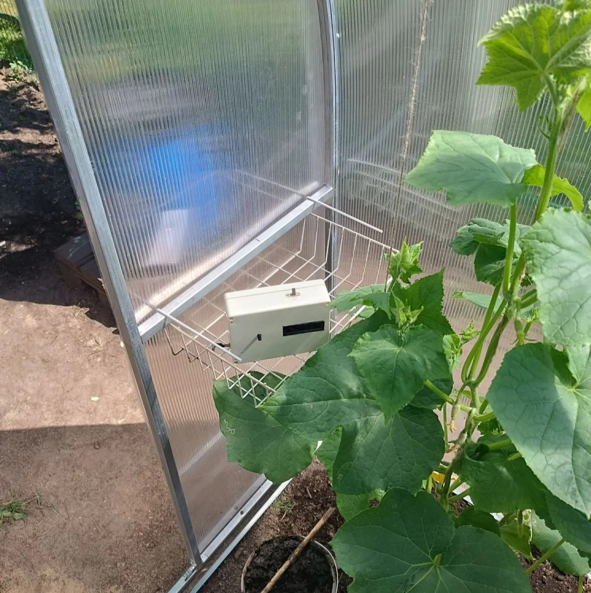
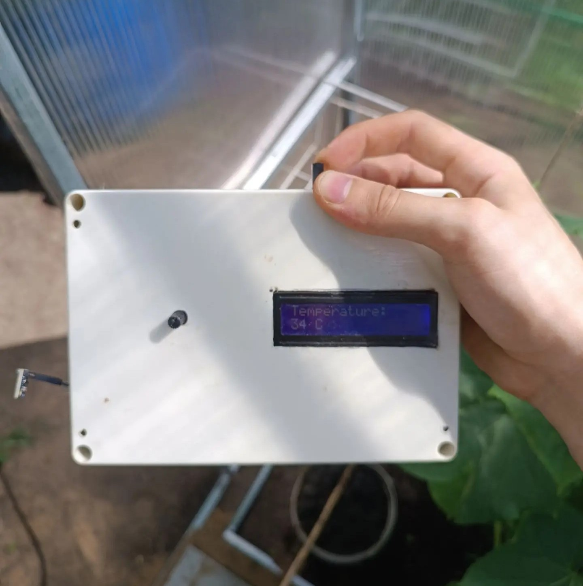
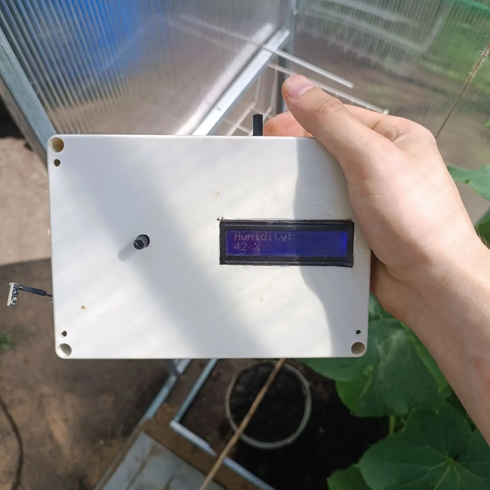

# Greenhouse Weather Station with Page Switching

An Arduino-based environmental monitoring system that displays temperature and humidity on an LCD screen with potentiometer-controlled page switching and audible feedback.

## Photos 

### Device on a shelf

### Device in hands (showing temperature)

### Device in hands (showing humidity)

---

## Features

- Measures temperature (°C) and humidity (%) using HTU21D sensor
- 16×2 I2C LCD display
- Potentiometer to switch between temperature and humidity pages
- Buzzer provides audio feedback when switching pages
- Welcome message "Hello Sir!" on startup

## Components Required

| Component | Quantity |
|-----------|----------|
| Arduino Uno | 1 |
| HTU21D temperature/humidity sensor | 1 |
| 16×2 I2C LCD (address 0x27) | 1 |
| Potentiometer (10kΩ) | 1 |
| Piezo buzzer | 1 |
| Light sensor (LDR) – optional | 1 |
| Jumper wires | as needed |

## Pin Connections

| Component | Arduino Pin |
|-----------|-------------|
| HTU21D (I2C) | A4 (SDA), A5 (SCL) |
| I2C LCD (0x27) | A4 (SDA), A5 (SCL) |
| Potentiometer | A1 |
| Light sensor | A0 (reserved) |
| Buzzer | 8 |

## Required Libraries

Install these libraries via Arduino Library Manager:

- `LiquidCrystal_I2C` by Frank de Brabander
- `Adafruit_HTU21DF` by Adafruit
- `Wire` (built-in)

## How It Works

1. The potentiometer acts as a two-position selector:
   - **0–511** → Page 1: Temperature
   - **512–1023** → Page 2: Humidity

2. When the page changes, the buzzer plays a two-tone melody (523 Hz → 698 Hz)

3. The LCD updates every 100ms, showing the current page data

4. Startup displays "Hello Sir!" for 2 seconds before normal operation

## Usage

1. Upload the code to Arduino Uno
2. Open Serial Monitor (9600 baud) to see debug output
3. Turn the potentiometer to switch between temperature and humidity displays
4. Listen for the beep when changing pages

## License

Open source – feel free to use and modify.
